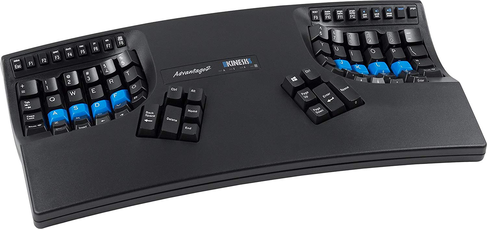

# Table of Contents

1.  [Who Am I?](#orgf119ea0)
2.  [Why would you want or need this?](#orgefb40e0)
    1.  [Benefits of Ergo keyboards](#orge9255b0)
        1.  [My personal reasons](#orga201c27)
        2.  [History of Typwriter According to Matt Addereth](#org788845c)
        3.  [Other relatable reasons (Programmers, emacs pinky)](#org1f0e51d)
    2.  [RSI Injuries & How to Avoid Them](#org9358d31)
        1.  [Ulnar deviation](#orgf3ebf23)
3.  [Notable Mentions](#org52ac60c)
    1.  [Kinesis Advantage2](#org0aae63f)
    2.  [ErgoDox](#org1a30e5d)
    3.  [Let's Split](#org92bb72c)
    4.  [Atreus](#orgf79ca43)
    5.  [Signum (Troy Fletcher)](#org05c11fa)
    6.  [Other Dactyl Variations](#orgb8b300e)
        1.  [Ergo Dactyl](#org9008ef5)
        2.  [Lightcycle Dactyl](#org3b38a05)
        3.  [Dactyl Manuform](#org11dd1c7)
4.  [What is the Dactyl Keyboard?](#orgf0c9f23)
    1.  [History or Background](#org4d3cf77)
        1.  [Matt's Clojurcon Youtube Video](#org383496c)
        2.  [Matt's Reasons for making the design](#orgf380eed)
        3.  [Dactyl was Written in Clojure with the Help of OpenSCAD](#orgf8d6208)
    2.  [Reasons for Choosing Dactyl](#org5bfe9c2)
5.  [Dactyl Project](#org59b4daf)
    1.  [My Reasons for Building by Hand Instead of Purchasing](#org9241856)
    2.  [Build Overview](#org81cf56d)
        1.  [Shell/Case](#orgafacc21)
        2.  [Switches & Keycaps](#org8de5123)
        3.  [Hardware](#org77a6c82)
        4.  [PCB & Wiring](#org14747ba)
        5.  [Firmware](#orgcdc10c6)
        6.  [How Does it Work?](#orga0977ed)
        7.  [Challenges](#org131c24e)
6.  [Where To Buy](#orgc317661)
    1.  [MassDrop](#orgc5626e3)
    2.  [ErgodoxEZ](#org5885985)
    3.  [OhKeycaps.com](#org4b58a5c)

TODO Finish Website & Mirror Presentation Notees
TODO Gather Raw Data for Presentation

Prices
Ali Express for Keycap Price
Digikey for Hardware Cost
Collect Info & Tutorial Sources for

# Who Am I?

Tim Anderson

-   <https://github.com/mcdviii>
-   <http://aberrent.online>

I work in manufacturing as a machine operator for a local furniture
  manufacturer.
I tinker with electronics & free software on my free time.

# Why would you want or need this?

## Benefits of Ergo keyboards

While browsing around looking at these ergonomic keyboards I see a recurring
question:
"Why would you need/want that."
It seems like a fair question. I imagine in the eyes of an uninitiated it would
seem like RGB lighting on a personal computer: expensive, showy & unnecessary.
But I would argue there are real health benefits to using a proper ergonomic keyboard.

### My personal reasons

1.  I consider my hands to be my greatest physical asset, aside from what's floating around in my skull.

### History of Typwriter According to Matt Addereth

### Other relatable reasons (Programmers, emacs pinky)

1.  Only a normie would use an OEM keyboard!

## RSI Injuries & How to Avoid Them

-   I am not a doctor! I just searched causes for RSI issues! Don't shoot me!

### Ulnar deviation

# Notable Mentions

## Kinesis Advantage2

-   Advantages:
-   Disadvanteges: $320.00 USD
-   Open Source: No

## ErgoDox

-   Advantages:
-   Disadvantages:
-   Open Source:

## Let's Split

-   Advantages:
-   Disadvantages:
-   Open Source:

## Atreus

-   Advantages:
-   Disadvantages:
-   Open Source:

## Signum (Troy Fletcher)

-   Advantages:
-   Disadvantages:
-   Open Source:

## Other Dactyl Variations

### Ergo Dactyl

-   Advantages:
-   Disadvantages:
-   Open Source:

### Lightcycle Dactyl

-   Advantages:
-   Disadvantages:
-   Open Source:

### Dactyl Manuform

-   Advantages:
-   Disadvantages:
-   Open Source:

# What is the Dactyl Keyboard?

-   Columnar, Ortholinear, written in Clojure

## History or Background

### Matt's Clojurcon Youtube Video

### Matt's Reasons for making the design

### Dactyl was Written in Clojure with the Help of OpenSCAD

## Reasons for Choosing Dactyl

-   Kinesis Advantage form factor
-   Open Source
-   Looked like the most comfortable design
-   Also looked hella cool

# Dactyl Project

## My Reasons for Building by Hand Instead of Purchasing

-   At the time there were none being manufactured
-   Sense of self-satisfaction
-   Building my own helps me to improve the project by contributing personal
    improvements back (Open Source)
-   I already own a 3D printer
-   Screw paying someone else >$300, I'll just build my own!
-   One year later joke

## Build Overview

### Shell/Case

### Switches & Keycaps

### Hardware

### PCB & Wiring

### Firmware

### How Does it Work?

-   Explain matrix positions

### Challenges

-   Which way to wire the diodes
-   How the keyboard is controlled by the MC (key matrix)

# Where To Buy

-   I have no affiliation or experience with the following. YMMV!

## MassDrop

-   Crowd sourced limited manufacturing.

## ErgodoxEZ

## OhKeycaps.com

