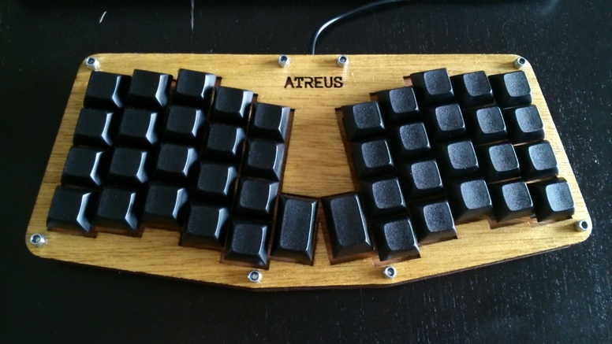

TODO Finish Website & Mirror Presentation Notees
TODO Gather Raw Data for Presentation

Prices
Ali Express for Keycap Price
Digikey for Hardware Cost
Collect Info & Tutorial Sources for

# Tim Anderson

Who am I?

-   <https://github.com/mcdviii>
-   <http://aberrent.online>

I work in manufacturing as a machine operator for a local furniture
  manufacturer.
I tinker with electronics & free software on my free time.

# Why would you want or need this?

## Benefits of Ergo keyboards

While browsing around looking at these ergonomic keyboards I see a recurring
question:
"Why would you need/want that."
It seems like a fair question. I imagine in the eyes of an uninitiated it would
seem like RGB lighting on a personal computer: expensive, showy & unnecessary.
But I would argue there are real health benefits to using a proper ergonomic keyboard.

## Let's look at a regular keyboard

-   History of Typwriter According to Matt Addereth
-   RSI Injuries & How to Avoid Them
-   I am not a doctor! I just searched causes for RSI issues! Don't shoot me!
-   Compare bad hand posture to OEM keyboard
-   Ulnar deviation
-   Other relatable reasons (Programmers, emacs pinky)
-   My personal reasons
-   I consider my hands to be my greatest physical asset, aside from what's floating around in my skull.

# Notable Mentions

## Kinesis Advantage2

-   Advantages:
-   Disadvanteges: $320.00 USD
-   Open Source: No

## ErgoDox

-   Advantages:
-   Disadvantages:
-   Open Source:

## Let's Split

-   Advantages:
-   Disadvantages:
-   Open Source:

## Atreus

-   Advantages: Small, single-board formfactor
-   Disadvantages: Not a split design,
-   Open Source: Yes

## Signum 3 (Troy Fletcher)

-   Advantages:
-   Disadvantages:
-   Open Source:

Notable differences between the Signum 3 & Atreus are the thumb clusters.

## Other Dactyl Variations

### Ergo Dactyl

-   Advantages:
-   Disadvantages:
-   Open Source:

Redesigned to fit Ergodox keycaps.

### Lightcycle Dactyl

-   Advantages:
-   Disadvantages:
-   Open Source:

### Dactyl Manuform

-   Advantages:
-   Disadvantages:
-   Open Source:

# What is the Dactyl Keyboard?

-   Columnar, Ortholinear, written in Clojure

## History or Background

### Matt's Clojurcon Youtube Video

### Matt's Reasons for making the design

### Dactyl was Written in Clojure with the Help of OpenSCAD

## Reasons for Choosing Dactyl

-   Kinesis Advantage form factor
-   Open Source
-   Looked like the most comfortable design
-   Also looked hella cool

# Dactyl Project

## My Reasons for Building by Hand Instead of Purchasing

-   At the time there were none being manufactured
-   Sense of self-satisfaction
-   Building my own helps me to improve the project by contributing personal
    improvements back (Open Source)
-   I already own a 3D printer
-   Screw paying someone else >$300, I'll just build my own!
-   One year later joke

## Build Overview

### Shell/Case

### Switches & Keycaps

### Hardware

### PCB & Wiring

### Firmware

### How Does it Work?

-   Explain matrix positions

### Challenges

-   Which way to wire the diodes
-   How the keyboard is controlled by the MC (key matrix)

# Where To Buy

I have no affiliation or experience with the following. YMMV!

-   [Drop.com (formerly MassDrop)](https://drop.com)

Crowd sourced, limited manufacturing.

-   [Ergodox EZ](https://ergodox-ez.com)
-   [OhKeycaps.com](https://ohkeycaps.com)

